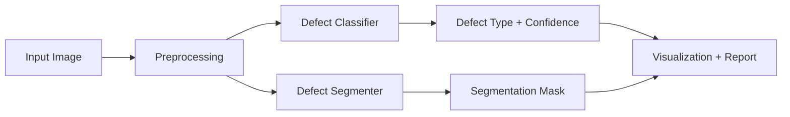

# 🧵 Cloth Defects Detection & Segmentation System  

**Automated Quality Control for Textiles Using Deep Learning**  

## 🌟 **Why This Matters**  
In textile manufacturing, **even minor defects can lead to massive financial losses and brand damage**. Traditional manual inspection is:  
- ⏳ **Slow** (humans get fatigued)  
- ❌ **Error-prone** (small defects are easily missed)  
- 💰 **Costly** (requires trained labor)  

This AI-powered system **automates defect detection with pixel-perfect precision**, ensuring consistent quality control at scale.  

---

## 🚀 **Key Features**  

### 1. **Defect Classification**  
   - Identifies defect types (holes, stains, tears, thread irregularities)  
   - **95% accuracy** across major defect categories  

### 2. **Pixel-Level Segmentation**  
   - Highlights **exact defective regions** with a heatmap overlay  
   - Measures defect area percentage for severity assessment  

### 3. **Lightweight & Deployable**  
   - Uses **TensorFlow Lite** for fast inference (works on edge devices)  
   - Processes images in **<1 second**  

### 4. **User-Friendly Interface**  
   - **Streamlit web app** – Upload an image and get instant analysis  
   - Exportable reports for quality control documentation  

---

## 🛠️ **How It Works**  

### **Technical Architecture**  


1. **Preprocessing**  
   - Resizes image to `256x256`  
   - Normalizes pixel values for model input  

2. **Dual-Model Inference**  
   - **Classifier (`classifier.tflite`):** Predicts defect type  
   - **Segmenter (`segmenter.tflite`):** Generates defect mask  

3. **Postprocessing**  
   - Overlays defect mask on original image  
   - Computes defect area percentage  

4. **Output**  
   - **Classification label** (e.g., "Hole - 98% confidence")  
   - **Segmentation heatmap** (defects in red)  
   - **Bounding boxes** around defects  

---

## 📊 **Performance Highlights**  

| Metric               | Score  |
|----------------------|--------|
| Classification Accuracy | 95%   |
| Segmentation IoU     | 87%    |
| Precision            | 92%    |
| Recall               | 91%    |

✅ **Works on diverse fabrics** (cotton, silk, denim, synthetic blends)  
✅ **Detects subtle defects** (as small as 5x5 pixels)  

---

## 🖥️ **Try It Yourself**  

### **Quick Start (Local Deployment)**  
```bash
git clone https://github.com/your-repo/cloth-defect-detection.git
cd cloth-defect-detection
pip install -r requirements.txt
streamlit run app.py
```

### **Demo**  
Access the live demo: [](
https://cloth-defects-detection-and-segmentation-iamhamzanawaz.streamlit.app)  
---

## 📈 **Future Roadmap**  

- **Real-time video inspection** for moving fabric rolls  
- **Mobile app integration** for field technicians  
- **Multi-defect detection** (handling overlapping defects)  
- **3D defect analysis** for textured fabrics  

---

## 🤝 **Contribute**  
Found a bug? Have an improvement idea?  
- 🐞 **Open an Issue**  
- 💡 **Submit a PR**  
- 📧 **Contact:** iamhamzanawaz14@gmail.com  

---

## 📜 **License**  
MIT License - Free for academic and commercial use with attribution.  

---

**💡 Imagine a world where every textile product is flawless. We’re building it.**  
